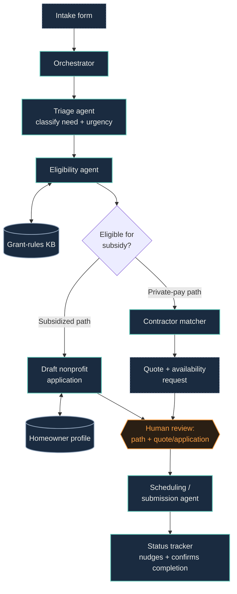

# Household-to-Habitat

One agent that triages a home-accessibility need across three possible paths: pay a contractor directly, or qualify for a subsidized nonprofit program — and handles the coordination for whichever path fits.

← back to [[00 Index]]

## Problem & who it's for

Aging or disabled homeowners need modifications (grab bars, ramps, wider doorways) to stay safely in their homes. Today, figuring out whether you qualify for a subsidized program (HUD OAHMP, USDA Section 504, Habitat for Humanity Aging in Place, Rebuilding Together, state programs) versus just paying a contractor directly is entirely manual — homeowners either don't know these programs exist, or give up navigating eligibility paperwork and overpay a contractor for something that could've been subsidized or free.

**Who:** aging/disabled homeowners, their family members, contractors, and nonprofit home-modification programs.

**Where:** scoped to the US — the specific grant programs referenced (HUD, USDA, Habitat, Rebuilding Together) are US institutions. Would need real localization for other countries.

## Why this one (differentiation)

- All three hackathon tracks are genuinely load-bearing here — remove any one and the idea breaks:
  - **Everyday** — the homeowner's own need and home
  - **Professional** — the contractor quoting/scheduling side
  - **Good Neighbor** — the nonprofit subsidy/volunteer-labor side
- No AWS sample in `strands-agents/samples` covers this domain at all (industry categories are Finance/Healthcare/Logistics/Marketing/Productivity/Retail/Software Engineering — nothing nonprofit/community)
- No AI-agent product found automating this specific triage; the nonprofit programs that do this today (Habitat's Aging in Place program alone serves ~11,000 households/year) run it entirely manually

## Known risk

Eligibility rules for real grant programs are genuinely messy. A six-week build will have to simplify or partially mock the eligibility-checking step — and if judges probe it live, that's where it'll show. Getting it wrong isn't just an "unhelpful" failure mode either — it risks telling someone they don't qualify for help they actually do. Plan to be explicit in the pitch about which rules are real vs. simplified for the demo.

## Workflow

1. **Intake** — homeowner describes the need in plain language ("I need a wheelchair ramp") via a simple web form
2. **Triage agent** — classifies modification type (ramp, grab bars, doorway widening, bathroom mod) and urgency
3. **Eligibility agent** — checks income/age/location against a seeded rules knowledge base → decides subsidized-path vs. private-pay-path
4. **Branch:**
   - *Subsidized* → auto-drafts the nonprofit application packet from the homeowner's stored profile
   - *Private-pay* → matches a contractor from a directory, requests a quote + availability
5. **Human checkpoint** — homeowner reviews the recommended path and the quote/application before anything is submitted
6. **Scheduling agent** — books the contractor slot or submits the application
7. **Status agent** — tracks progress, nudges on missing documents, confirms completion

## Architecture

Node types: agent = Strands agent (reasons/decides) · tool = tool/API integration · store = memory/data store · human = human-in-the-loop checkpoint.

Orchestration pattern: **Graph** (real branching logic needed here, not a linear pipeline).

## Tech stack

- **Strands Agents SDK (Python)** — Graph orchestration pattern
- **Amazon Bedrock (Claude)** as model provider
- **Tools:**
  - Structured-output tool for the eligibility decision
  - Small Knowledge Base / RAG tool seeded with grant-program eligibility text
  - Mocked contractor directory (DynamoDB or JSON table for the demo)
  - Calendar tool for scheduling
- **Human-in-the-loop:** build on AWS's official `human-in-the-loop-approval-agent` sample (interrupt/resume pattern) — don't hand-roll this
- **Frontend:** Streamlit, based on AWS's official `streamlit-template` sample
- **Data store:** DynamoDB (homeowner profiles, eligibility rules, contractor directory, application status)
- **Deployment:** Bedrock AgentCore Runtime — full deployment effort justified since this is the flagship and AgentCore deployment is explicitly weighted in judging

## Automations — what's actually automated vs. what stays human

**Automated end-to-end:**
- Need classification
- Eligibility matching against seeded rules KB
- Application packet drafting (subsidized path)
- Contractor matching + quote request (private-pay path)
- Scheduling
- Status nudges on missing documents

**Stays human:**
- Final path approval (subsidized vs. private-pay) — homeowner confirms before anything moves forward
- Final approval before submit/book
- Contractor vetting — explicitly out of scope; demo assumes a pre-vetted directory

## Open build tasks

- [ ] Build the eligibility-rules knowledge base dataset (biggest unplanned-time risk — start this early, not week 4)
- [ ] Seed a mock contractor directory (5–10 contractors is enough for a convincing demo)
- [ ] Wire the Graph orchestration branch logic (subsidized vs. private-pay)
- [ ] Integrate the official human-in-the-loop approval sample
- [ ] AgentCore deployment
- [ ] Record demo video — one homeowner scenario per path (subsidized + private-pay) to show both branches working
