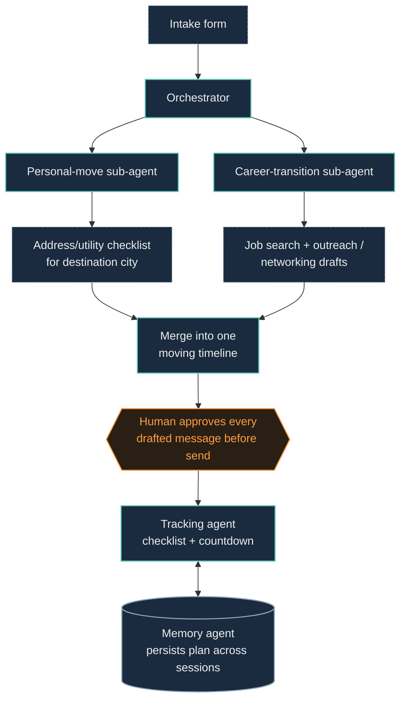

# Relocation Copilot

One agent for the move itself and the career transition that comes with it — deliberately scoped to a single city so the demo is convincing rather than generic.

← back to [[00 Index]]

## Problem & who it's for

Moving cities means running two totally separate admin tracks at once — personal logistics (utilities, address changes, school transfers) and professional logistics (job search or client handoff, networking in the new city) — and nothing fuses them into one flow.

**Who:** people relocating cities for a new job, a partner's job, or a life change — freelancers and employees alike.

**Where:** scoped to **one metro area** for the hackathon build. Utility/school-district automation is jurisdiction-specific, so a "works everywhere" version isn't realistic in six weeks — pick one city and be explicit about that scope in the pitch.

## Why this one (differentiation)

- Genuinely unclaimed pairing — found moving-logistics products (e.g. Updater, which auto-updates utilities/address) that cover the personal half, and career-transition tools/LinkedIn relocation filters that cover the professional half, but nothing found fusing the two into a single flow
- Pulls a different track exposure than Household-to-Habitat (Everyday × Professional vs. Everyday × Professional × Good Neighbor) — diversifies which judges/prize pools see it
- Forces different technical work than the flagship: integration-heavy (utility providers, job listings) vs. eligibility-reasoning-heavy — good use of a second build slot instead of overlapping skills

## Known risk

The demo only looks convincing if scoped tightly to one city — a "generalized" version would need too many jurisdiction-specific integrations to build believably in six weeks, and trying to fake generality usually reads as a toy. Commit to one metro area on purpose.

## Workflow

1. **Intake** — origin, destination city, move date, job status (already hired / job-searching), renting/owning
2. **Personal-move sub-agent** — generates address-change checklist, drafts utility-transfer requests for that one city's known providers, school-transfer checklist if relevant
3. **Career-transition sub-agent** — if job-searching: finds matching listings in the destination city and drafts outreach; if already hired: drafts "informing my network/clients" messages and a new-city bio update
4. **Orchestrator merges both threads** into one moving timeline (e.g. "Week -4: address change submitted · Week -3: 3 intro calls booked")
5. **Human checkpoint** — approves/edits every drafted message before it sends
6. **Tracking agent** — checks off completed items, counts down to moving day

## Architecture

Node types: agent = Strands agent (reasons/decides) · tool = tool/API integration · store = memory/data store · human = human-in-the-loop checkpoint.

Orchestration pattern: **Agents-as-Tools** (maps directly onto AWS's own "Teacher's Assistant" example — known-good scaffolding to build from).

## Tech stack

- **Strands Agents SDK** — Agents-as-Tools pattern
- **Tools:**
  - Web search / MCP tool for destination-city info (utility providers, job listings)
  - Structured checklist generator
  - Memory agent — reuse the official `memory_agent` example to persist the plan across sessions
- **Frontend:** same Streamlit shell as Household-to-Habitat — don't rebuild this twice, reskin it
- **Data store:** SQLite is genuinely fine here — doesn't need DynamoDB like the flagship
- **Deployment:** Lambda or Fargate rather than full AgentCore — save the deployment effort budget for Household-to-Habitat

## Automations — what's actually automated vs. what stays human

**Automated end-to-end:**
- Checklist generation (address change, utilities, school transfer)
- Address/utility-transfer drafts
- Job/networking search and shortlisting
- Outreach message drafting
- Deadline countdown nudges

**Stays human:**
- Approving every outbound message before it sends
- Confirming the checklist actually matches their situation

## Shared components with Household-to-Habitat

- Streamlit UI shell (reskinned)
- Human-in-the-loop interrupt/resume component
- Memory-agent pattern
- Bedrock model-provider setup / base orchestrator boilerplate

See [[00 Index]] for the full shared-infrastructure list.

## Open build tasks

- [ ] Pick the one city to scope the demo to
- [ ] Seed destination-city data (utility providers, a handful of mock job listings)
- [ ] Wire the Agents-as-Tools orchestration (personal-move + career-transition sub-agents)
- [ ] Reuse memory-agent example for cross-session plan persistence
- [ ] Reskin the shared Streamlit shell for this project
- [ ] Record demo video — one relocation scenario (job-searching persona) end-to-end
