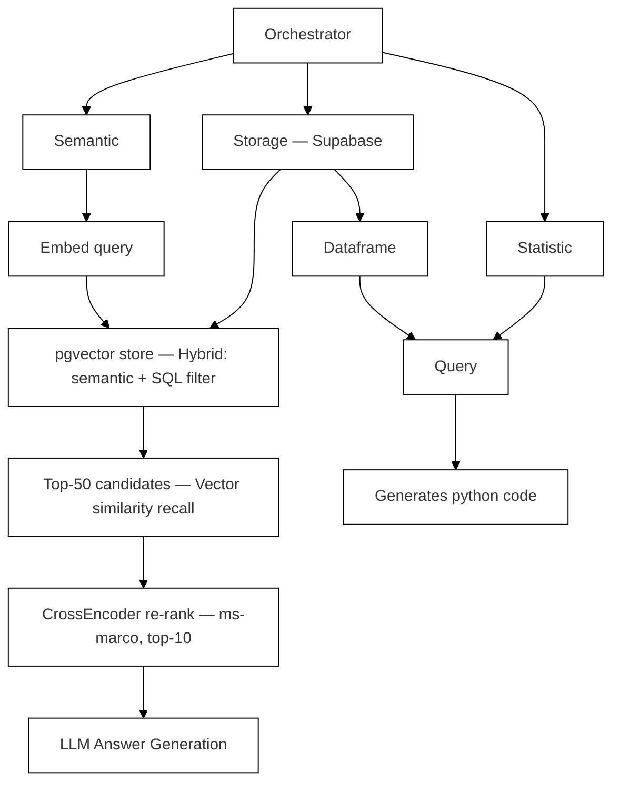

# Hierarchical RAG Pipeline Diagram (Paper Fig. 2)

Part of [[FLARE - Project Hub|FLARE]]. Recreation of the paper's Figure 2 — the hybrid retrieval + re-ranking flow inside the [[RAG Ingestion Pipeline]].

## Key numbers attached to this flow (paper Table VI)

| Stage | Avg. Latency |
|---|---|
| Hybrid pgvector query | 120ms |
| Semantic similarity scoring | 45ms |
| Keyword match (regex) | 15ms |
| Cross-Encoder re-ranking | 340ms |
| Context window population | 10ms |
| **Total** | **530ms** |

## Related
- [[System Architecture Diagram]] — paper Fig. 1, the full-system view
- [[RAG Ingestion Pipeline]]
- [[FLARE - Project Hub]]
