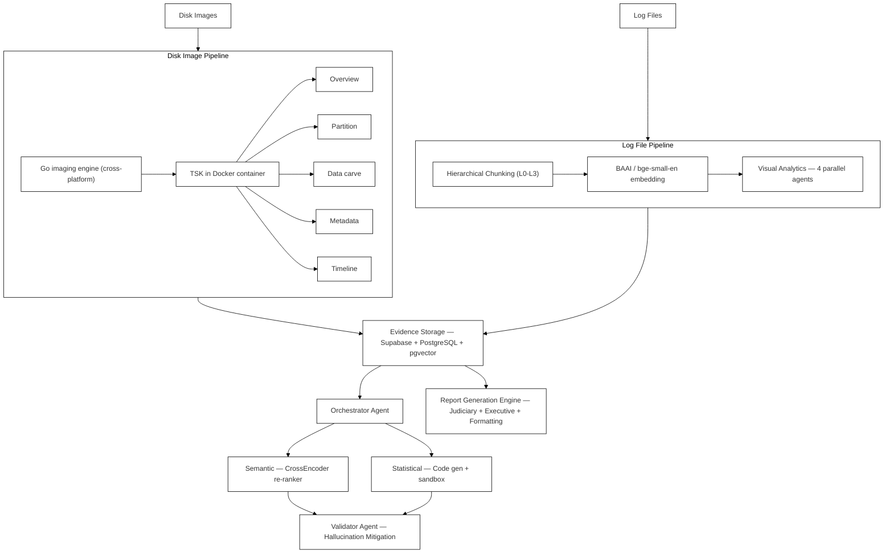

# System Architecture Diagram (Paper Fig. 1)

Part of [[FLARE - Project Hub|FLARE]]. Recreation of the paper's Figure 1 — overall system architecture — as Mermaid, since the vault can't embed the PDF's original image directly. See [[Paper Asset Index]] for where the source PDF lives on disk.

## Related
- [[Hierarchical RAG Pipeline Diagram]] — paper Fig. 2, the RAG-specific detail view
- [[Multi-Agent System Design]]
- [[FLARE - Project Hub]]
