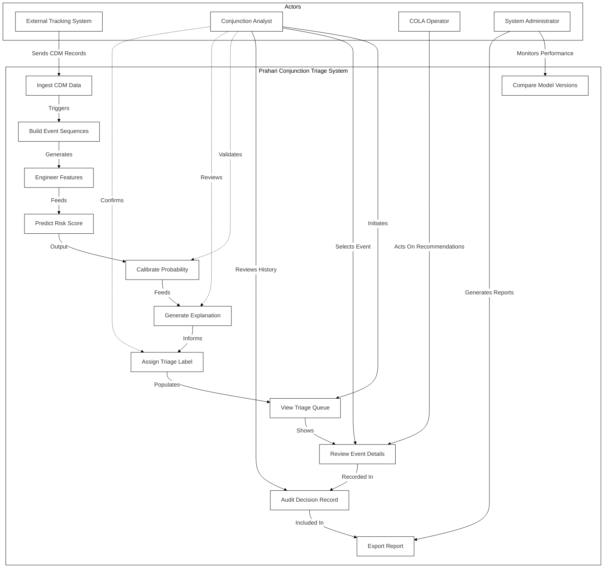

```mermaid
%%{init: {'theme': 'base', 'themeVariables': { 'primaryColor':'#ffffff', 'primaryBorderColor':'#000000', 'background':'#ffffff', 'mainBkg':'#ffffff', 'clusterBkg':'#ffffff', 'clusterBorder':'#000000', 'fontSize':'16px'}}}%%
graph TB
    subgraph system["Prahari Conjunction Triage System"]
        UC1["Ingest CDM Data"]
        UC2["Build Event Sequences"]
        UC3["Engineer Features"]
        UC4["Predict Risk Score"]
        UC5["Calibrate Probability"]
        UC6["Generate Explanation"]
        UC7["Assign Triage Label"]
        UC8["View Triage Queue"]
        UC9["Review Event Details"]
        UC10["Audit Decision Record"]
        UC11["Compare Model Versions"]
        UC12["Export Report"]
    end

    subgraph actors["Actors"]
        EXTERNAL["External Tracking System"]
        ANALYST["Conjunction Analyst"]
        OPERATOR["COLA Operator"]
        ADMIN["System Administrator"]
    end

    EXTERNAL -->|Sends CDM Records| UC1
    ANALYST -->|Initiates| UC8
    ANALYST -->|Selects Event| UC9
    ANALYST -->|Reviews History| UC10
    ADMIN -->|Monitors Performance| UC11
    ADMIN -->|Generates Reports| UC12
    OPERATOR -->|Acts On Recommendations| UC9

    UC1 -->|Triggers| UC2
    UC2 -->|Generates| UC3
    UC3 -->|Feeds| UC4
    UC4 -->|Output| UC5
    UC5 -->|Feeds| UC6
    UC6 -->|Informs| UC7
    UC7 -->|Populates| UC8
    UC8 -->|Shows| UC9
    UC9 -->|Recorded In| UC10
    UC10 -->|Included In| UC12

    ANALYST -.->|Validates| UC5
    ANALYST -.->|Reviews| UC6
    ANALYST -.->|Confirms| UC7
```
