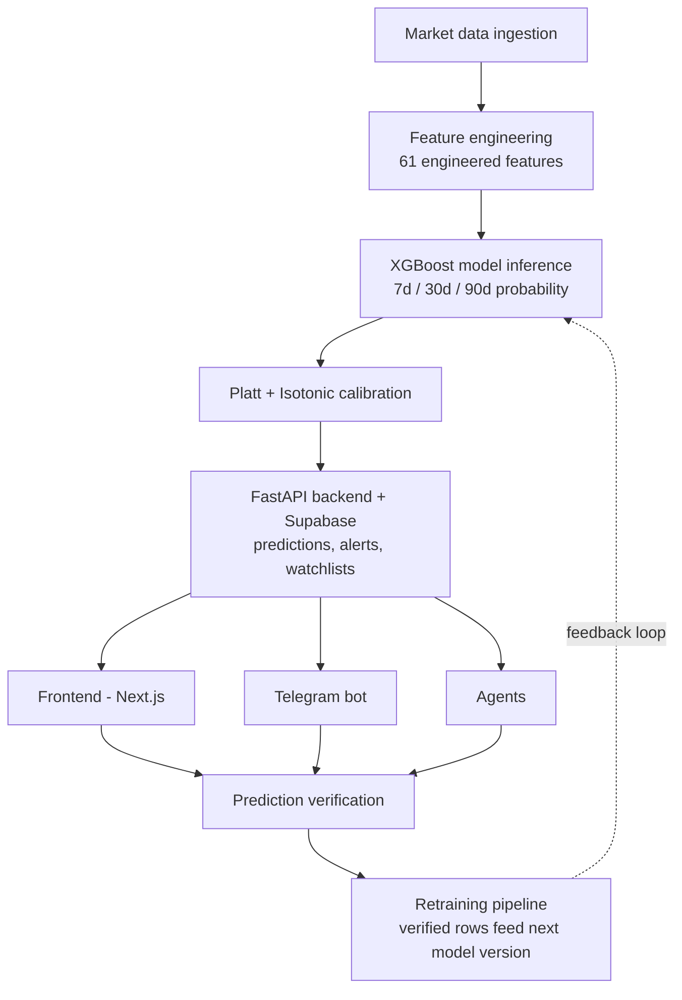

# Oracle — Architecture

## Agents (5 built)
1. **Watchdog** — Google News RSS + Groq LLaMA 8b, contradiction detection
2. **Portfolio Risk scorer** — Groq LLaMA 70b
3. **Narrator** — SHAP-to-English explanations
4. **Screener**
5. **Chat/RAG** — planned, not yet built

## Telegram Bot
- 9 commands implemented
- Telegram Bot API
- Alert-firing pipeline (GitHub Actions) — working, no known issues

## End-to-end workflow (data flow)

**Flow summary:**
1. **Market data ingestion** — raw price/volume data pulled for tracked tickers across markets
2. **Feature engineering** — raw data transformed into the 61 features the model expects
3. **XGBoost inference** — produces raw probability estimates for 7d/30d/90d moves
4. **Calibration** — Platt + Isotonic makes the probabilities honest, not just confident-sounding
5. **FastAPI + Supabase** — calibrated predictions and related data stored and served
6. **Fan-out** — Frontend, Telegram bot, and Agents all consume from the backend
7. **Verification** — real outcomes checked against predictions (this is where the 4 data bugs were caught)
8. **Retraining** — verified data accumulates and retrains the model, closing the loop back into inference

This loop is the current focus — verified data has piled up and a retrain is overdue (see [[04-Open-Issues]]).
